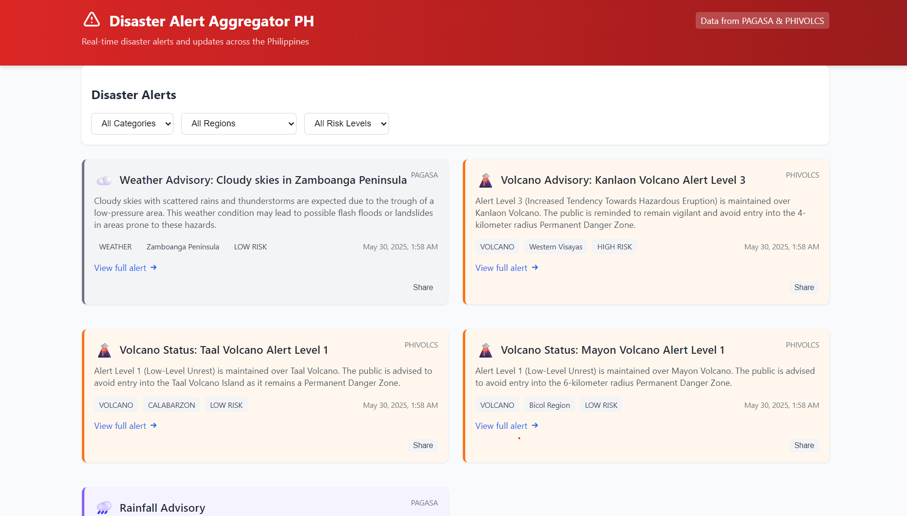

# Disaster Alert Aggregator PH

A real-time disaster alert aggregator for the Philippines, collecting information from official government sources including PAGASA, PHIVOLCS, USGS, and OpenWeatherMap.



## 📋 Project Overview

This application aggregates and displays real-time disaster alerts in the Philippines by:

1. Scraping official government sources (PAGASA, PHIVOLCS)
2. Collecting data from reliable APIs (USGS Earthquake, OpenWeatherMap)
3. Categorizing alerts by severity and type
4. Storing alerts in a Supabase database
5. Displaying them through a React + TypeScript frontend with real-time updates

The system is designed to capture all levels of disaster alerts - from high-risk emergency situations to low-level weather advisories - enabling users to stay informed and prepare proactively.

### Key Features

- **Real-time Updates**: Displays alerts as they are published using Supabase Realtime
- **Alert Coverage**: Captures disaster-related information with meaningful content, filtering out alerts with insufficient information
- **Risk Severity Indication**: Categorizes alerts by severity (high, medium, low) to help prioritize response
- **Advanced Filtering**: Filter alerts by category, region, and severity level with mobile-friendly toggle controls
- **Pagination**: Navigate through alerts with an intuitive pagination system
- **Mobile-First Design**: Compact, responsive interface optimized for all devices with expandable alerts
- **Automated Scraping**: Scheduled scraper runs every 15 minutes via GitHub Actions
- **Scraper Status Monitoring**: Track when the scraper last ran and view diagnostic information

## 🛠️ Tech Stack

- **Frontend**: 
  - React 19
  - TypeScript 4.9
  - Tailwind CSS
  - Craco (Create React App Configuration Override)

- **Backend**: 
  - Supabase (PostgreSQL, Realtime, Auth, Storage)
  - Node.js API endpoints

- **Web Scraper**: 
  - Node.js with Cheerio for HTML parsing
  - Axios for HTTP requests
  - Integration with external APIs (USGS, OpenWeatherMap)

- **Deployment**: 
  - Vercel (Frontend)
  - Supabase (Backend)
  - GitHub Actions (Scraper Scheduler)

## 🚀 Getting Started

### Prerequisites

- Node.js (v18+)
- npm or yarn
- Supabase account

### Setup

1. **Clone the repository**

```bash
git clone https://github.com/KCprsnlcc/disaster-alert-aggregator-ph.git
cd disaster-alert-aggregator-ph
```

2. **Install dependencies**

```bash
npm install
```

3. **Set up Supabase**

   - Create a new Supabase project
   - Run the SQL in `db/schema.sql` in the Supabase SQL editor
   - Get your Supabase URL and anon key from the API settings

4. **Configure environment variables**

   Create a `.env` file in the root directory with:

```
REACT_APP_SUPABASE_URL=your_supabase_url
REACT_APP_SUPABASE_ANON_KEY=your_supabase_anon_key
OPENWEATHERMAP_API_KEY=your_openweathermap_api_key
```

   For the scraper service, you'll also need to add:

```
SUPABASE_KEY=your_supabase_service_role_key
```

   **IMPORTANT:** Never commit your `.env` file or expose API keys in your code. The `.env` file is already in `.gitignore` to prevent accidental commits. For production deployments, set these as environment variables in your hosting platform.

5. **Start the development server**

```bash
npm start
```

## 🤖 Running the Scraper

The scraper fetches data from PAGASA, PHIVOLCS, USGS Earthquake API, and OpenWeatherMap API, then stores it in your Supabase database.

### Local Testing

```bash
cd scraper
npm install
node index.js
```

For testing purposes without making actual web requests:

```bash
cd scraper
node test-scraper.js
```

The scraper will collect alerts from all risk levels (high, medium, low) as long as they contain meaningful information. Alerts with insufficient information are automatically filtered out regardless of risk level.

### Deployment

The scraper is designed to run in GitHub Actions using the workflow in `.github/workflows/scraper-schedule.yml`, executing every 15 minutes.

You'll need to add your Supabase credentials as GitHub Secrets:

- `SUPABASE_URL`
- `SUPABASE_KEY`

## 📱 Frontend Structure

- `src/components/Dashboard.tsx`: Main component that fetches and displays alerts
- `src/components/AlertCard.tsx`: Card component for individual alerts with severity indicators
- `src/components/FilterBar.tsx`: Filtering UI for category, region, and severity level
- `src/components/Pagination.tsx`: Pagination controls for navigating through alerts
- `src/components/ScraperStatus.tsx`: Shows the last run time of the scraper
- `src/components/Header.tsx`: Application header with title and navigation
- `src/components/Footer.tsx`: Footer with links and attribution
- `src/supabase.ts`: Supabase client and TypeScript types

## 🗄️ Database Structure

The main table is `disaster_alerts` with the following schema:

- `id`: UUID (primary key)
- `source`: Text (source of the alert)
- `title`: Text (alert title)
- `description`: Text (detailed information)
- `category`: Text (typhoon, earthquake, flood, volcano, rainfall, landslide, weather)
- `region`: Text (affected area)
- `published_at`: Timestamp
- `link`: Text (URL to source)
- `severity`: Text (low, medium, high)
- `created_at`: Timestamp

Additional database scripts are located in the `db` directory:
- `schema.sql`: Main schema definition
- `complete_schema.sql`: Extended schema with additional features
- `scraper_logs_table.sql`: Logging table for scraper operations

## 🧪 Testing

```bash
npm test
```

The project includes testing utilities and configurations for React components using the latest Testing Library packages.

## 📦 Building for Production

```bash
npm run build
```

The build output will be in the `build` directory and is optimized with Craco configuration.

## 📤 Deployment

### Frontend (Vercel)

1. Connect your GitHub repository to Vercel
2. Set the environment variables in the Vercel project settings
3. Deploy from the main branch

The deployment is configured via `vercel.json` in the root directory.

### Scraper (GitHub Actions)

The scraper will run automatically every 15 minutes once you've set up the GitHub Secrets.
You can also manually trigger the workflow from the GitHub Actions tab.

## 📎 Notes

- All timestamps are in Philippine Standard Time (UTC+8)
- No login is required to view alerts (anonymous public access)
- Alerts are categorized by severity (high, medium, low) to help users prioritize their response
- The system captures all types of alerts, including low-level advisories that may develop into more serious situations
- Categories include: typhoon, earthquake, flood, volcano, rainfall, landslide, and general weather
- Data is sourced from official government websites and reliable APIs, but this is not an official service

## 🔒 Security

Security vulnerability reporting guidelines are available in the SECURITY.md file.

## 🙏 Acknowledgements

- [PAGASA](https://www.pagasa.dost.gov.ph/) - Philippine Atmospheric, Geophysical and Astronomical Services Administration
- [PHIVOLCS](https://www.phivolcs.dost.gov.ph/) - Philippine Institute of Volcanology and Seismology
- [USGS](https://earthquake.usgs.gov/) - U.S. Geological Survey for earthquake data
- [OpenWeatherMap](https://openweathermap.org/) - Weather data provider
